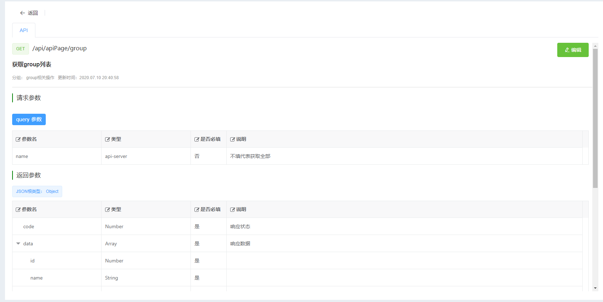
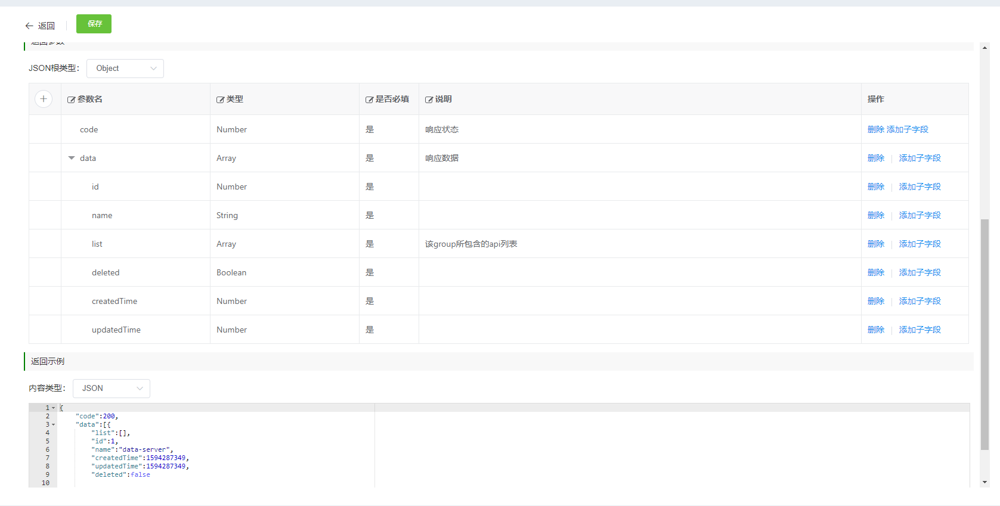
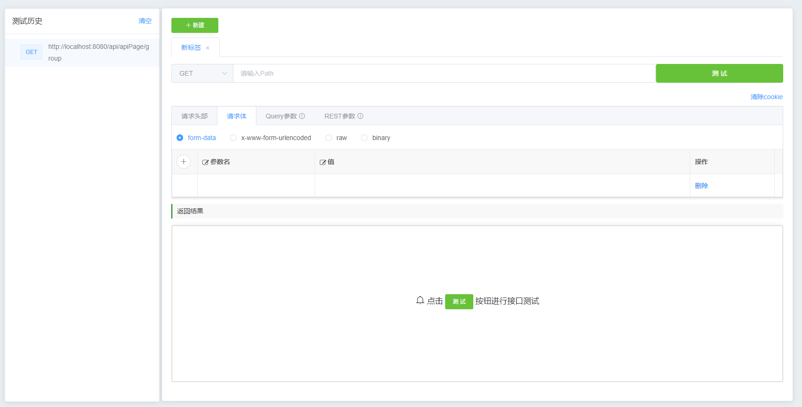
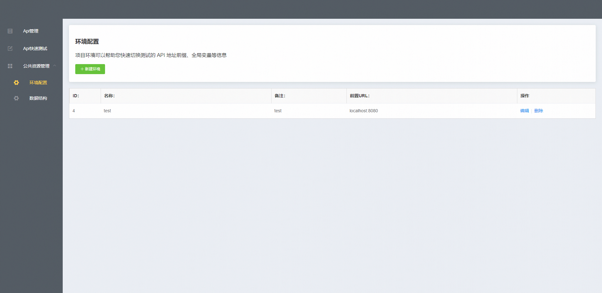
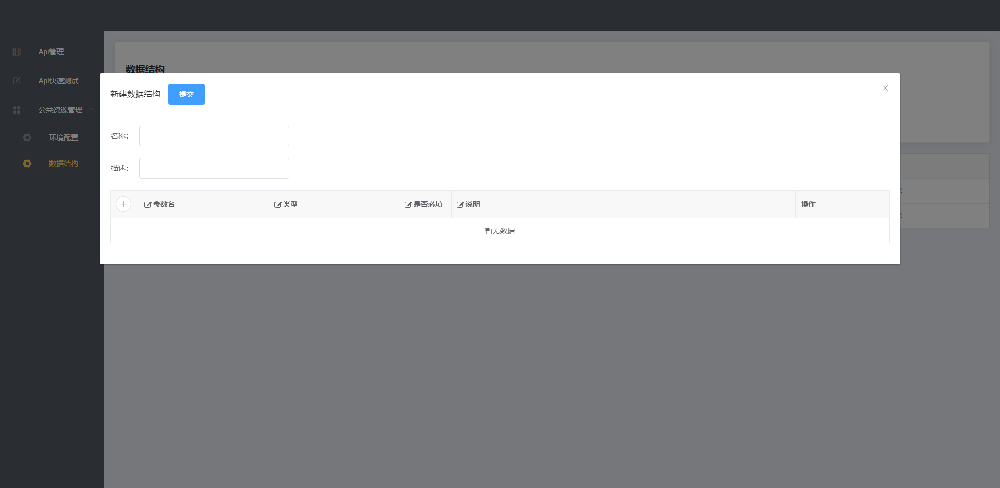

# api-mange

> 基于 vue 框架实现的接口管理平台

## 特点

- 使用 vue2 全家桶进行架构布局，搭配[element](https://github.com/ElemeFE/element) , [vxe-table](https://github.com/x-extends/vxe-table) 实现基本的 UI 操作

## 支持

- 接口文档基本信息编写，包括接口路径、请求方式、请求参数、返回示例等；
- 可管理多个接口数据平台，实现创建、修改、删除等功能；
- 可对接口进行快速测试，并且自动保存测试记录，方便后续调试；

## 部分界面显示

#### 首页

#### 详情页

#### 编辑页

#### 测试页面

#### 环境配置

#### 数据结构

## 待实现功能

- 用户登录、权限管理；
- 快速测试添加更多的参数配置；
- 导出 markdown 格式的文档；
